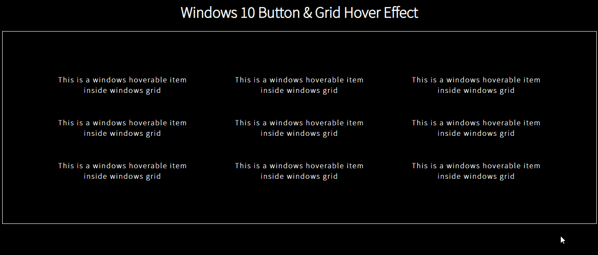

# react-win-grid

A lightweight and customisable Windows 10 Grid Component for ReactJS.



## Table of contents

-   [Changelog](#changelog)
-   [Installation](#installation)
-   [Getting Started](#getting-started)
-   [WinItem](#winitem)
-   [WinGrid](#wingrid)
-   [DEMO](#demo)

## Changelog

-   @1.0.\* - First stable version

## Installation

```javascript
npm install react-win-grid
```

## Getting Started

```javascript
import { WinGrid, WinItem } from 'react-win-grid';
```

#### OR

```javascript
const { WinGrid, WinItem } = require('react-win-grid');
```

## WinItem

This is a button component. Use this for individual clickable/hoverable items in your layout.
This can be used inside of `WinGrid` or as a standalone component.
Below is a list of props (optional) you can pass to the component.

| props            | description                                                          | type             | acceptable values                                                                                                              |
| ---------------- | -------------------------------------------------------------------- | ---------------- | ------------------------------------------------------------------------------------------------------------------------------ |
| backgroundColors | Colors that will be applied as gradient on background on mouse hover | Array of strings | All color values supported by CSS                                                                                              |
| borderColors     | Colors that will applied as gradient on borders on mouse hover       | Array of strings | All color values supported by CSS                                                                                              |
| borderWidth      | Border thickness in pixels                                           | Number           | Any positive number                                                                                                            |
| className        | HTML `class` attribute equivalent                                    | String           | -                                                                                                                              |
| contentIsImage   | This prop is recommended when the child is any image element.        | Boolean          | `true \| false`                                                                                                                |
| disabled         | Disable the WinItem                                                  | Boolean          | `true \| false`                                                                                                                |
| eventHandlers    | Event Handlers for the component                                     | Object           | `key` should be valid [React event](https://reactjs.org/docs/events.html) names and `value` will be the event handler function |
| onlyBackground   | Don't apply hover effect on borders                                  | Boolean          | `true \| false`                                                                                                                |
| onlyBorders      | Don't apply hover effect on background                               | Boolean          | `true \| false`                                                                                                                |
| style            | CSS styles for the component                                         | Object           | Valid css properties (camelCased)                                                                                              |

> ⚠ **Note**: Adding the `contentIsImage` prop to `WinItem` will not allow events to pass down to its children elements as this adds a layer on top of the image for hover effect to be visible. However, you can still set event handlers on the component itself by adding the `eventHandlers` prop. You can instead put image and non image in seperate `WinItem`s

```javascript
//The button will not receive click event
<WinItem contentIsImage>
	
	<button onClick={() => console.log('click')}> I am unclickable</button>
</WinItem>
```

## WinGrid

This is a CSS grid component with the Windows10 grid hover effect.
Use this layout to arrange and all the items inside this component should be either `WinItem` or HTML elements.
If you want to pass your react component to this, wrap it inside `WinItem`.
All the props mentioned below are optional

| props           | description                                                                                                                                                                                    | type             | acceptable values                                                                                                                                                                  |
| --------------- | ---------------------------------------------------------------------------------------------------------------------------------------------------------------------------------------------- | ---------------- | ---------------------------------------------------------------------------------------------------------------------------------------------------------------------------------- |
| borderColors    | Colors that will applied as gradient on borders on mouse hover                                                                                                                                 | Array of strings | All color values supported by CSS                                                                                                                                                  |
| borderWidth     | Border thickness in pixels                                                                                                                                                                     | Number           | Any positive number                                                                                                                                                                |
| className       | HTML `class` attribute equivalent                                                                                                                                                              | String           | -                                                                                                                                                                                  |
| directions      | `directions` parameter specified in [cursor-nearby-elements](https://www.npmjs.com/package/cursor-nearby-elements#nearbyelements-directionsoffset) package                                     | Number           | Positive integers                                                                                                                                                                  |
| eventHandlers   | Event Handlers for the component                                                                                                                                                               | Object           | `key` should be valid [React event](https://reactjs.org/docs/events.html) names and `value` will be the event handler function                                                     |
| highlightRadius | This value is like factor which multiplies with the original spotlight radius aka `offset` resulting in smaller or bigger radius                                                               | Object           | Valid css properties (camelCased)                                                                                                                                                  |
| offsetPoints    | `offsetPoints` parameter specified in [cursor-nearby-elements](https://www.npmjs.com/package/cursor-nearby-elements#nearby-event--predicate-modifier-offsetpoints-shouldskipangle-) package    | Array of floats  | Positive float values (Refer the [package](https://www.npmjs.com/package/cursor-nearby-elements#nearby-event--predicate-modifier-offsetpoints-shouldskipangle-) for default value) |
| shouldSkipAngle | `shouldSkipAngle` parameter specified in [cursor-nearby-elements](https://www.npmjs.com/package/cursor-nearby-elements#nearby-event--predicate-modifier-offsetpoints-shouldskipangle-) package | Number           | Positive integers                                                                                                                                                                  |
| style           | CSS styles for the component                                                                                                                                                                   | Object           | Valid css properties (camelCased)                                                                                                                                                  |

> 💡 **Tip**: Use the `offsetPoints` and `directions` props to fine tune the performance of the `WinGrid` based on your layout

## DEMO

[](https://codesandbox.io/s/react-wingrid-demo-sehd5?fontsize=14&hidenavigation=1&theme=light&view=preview)
